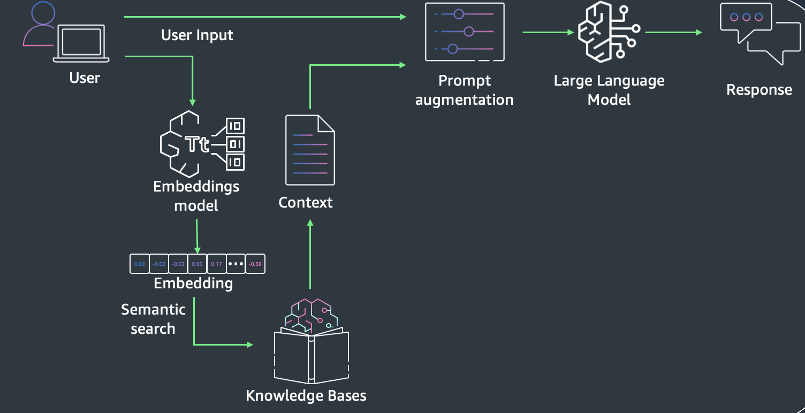
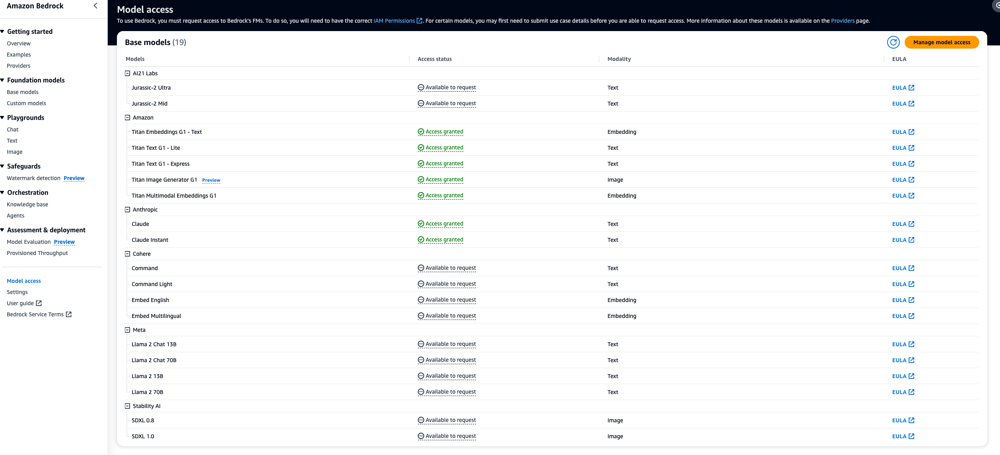

# GenAI RAG Workshop

This hands-on workshop is tailored for students to get introduced to GenAI on AWS. The main focus of this hands-on part is Retrieval Augmented Generation using [Amazon Bedrock](https://aws.amazon.com/bedrock/).

Amazon Bedrock is a fully managed service that provides access to FMs from third-party providers and Amazon; available via an API. With Bedrock, you can choose from a variety of models to find the one that’s best suited for your use case.

The workshop includes the following 2 Labs:

- **Part 1: RAG and KnowledgeBases** \[Estimated time to complete - 30 mins\]
- **Part 2: Deploy a simple RAG chatbot** \[Estimated time to complete - 30 mins\]

## Getting started

In order to follow along in the workshop complete the following sequence of steps:

### Access the AWS Account
1. Access the AWS account using the link below and add the access code next to the equal sign. Use the access code provided by the workshop hosts.
   Link: https://catalog.us-east-1.prod.workshops.aws/join?access-code=
2. Follow the requested steps until you can access the AWS account.
3. Make sure the region on the top right corner of the AWS console says Oregon (same as us-west-2).

### Enable Bedrock Model Access
1. Type in "Bedrock" into the search bar and click on Bedrock to access the service console.
2. Click on "Model Access" on the bottom left corner and then click on "Manage model access" on the top right corner of the AWS Console.
3. Select all models from Amazon + all models from Anthropic and click on "save changes". Once the permissions have been approved (2-3 min) your screen should reflect the following state:

### Create SageMaker Studio Domain and modify Role
1. Type in "SageMaker" into the search bar and click on SageMaker to access the service console.
2. Click on "Studio" on the top left and then "create sagemaker domain" on the top right of the AWS console. Use the default option. This can take a few minutes.
3. Type in "IAM" into the search bar and then search for the role which starts with "AmazonSageMaker-ExecutionRole-". Click on it and attach an Admin Policy.
4. Go back to SageMaker and open the SageMaker Studio.
5. Click on "Studio Classic" and then click on "Open" to access the SageMaker Studio Environment where you can run your python notebooks. This step can take a few minutes until your instances have been provisioned. 
6. Click on the version control icon on the top left and select "Clone a repository". Insert the GitHub repository (https://github.com/gabriel-rodriguez-garcia/genai_rag_workshop.git) and click on clone. Alternatively you can open a terminal and clone the repo using standard git comands.
7. You are all set and ready to experiment with some RAG workflows!

### Create a Cloud9 Instance and deploy the Stack
1. Type in "Cloud9" into the search bar and click on Cloud9 to access the service console.
2. Click on "Create environment". Provide a name, choose m5.large instance and leave the rest as is. Click on "Create". This will take a couple of minutes to provision.
3. Open the Cloud9 environment and clone the repo "git clone https://github.com/gabriel-rodriguez-garcia/genai_rag_workshop.git" and finally cd into genai_rag_workshop.
4. run scripts/cloud9-resize.sh, enter 1 for the EBS volume to resize and then enter 100 for the Storage.
5. create a python virtual environment by running "python3 -m venv .venv" and activate using "source .venv/bin/activate"
6. install all requirements by running "pip install -r requirments.txt"
7. run "cdk bootstrap" once, to prime the account for upcoming cdk deployments.
8. run "cdk synth" to synthesize the stack and then "cdk deploy" to deploy the stack into the account.
9. congratulations you have deployed your first GenAI RAG App!

## References

- Part 1 is based on the official Amazon Bedrock Workshop and can be found here [Original Amazon Bedrock Workshop](https://catalog.us-east-1.prod.workshops.aws/workshops/a4bdb007-5600-4368-81c5-ff5b4154f518/en-US).

- Part 2 is based on the open-source aws bedrock chatbot and can be found here [GenAI Bedrock Chatbot](https://github.com/awslabs/genai-bedrock-chatbot).

